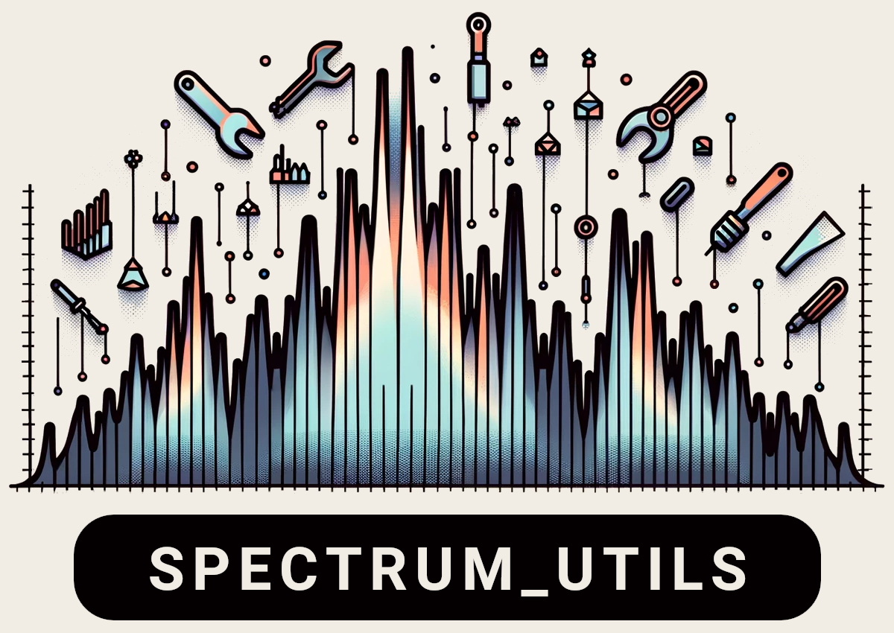

# spectrum_utils

spectrum_utils is a Python package for efficient MS/MS spectrum processing and
visualization.

spectrum_utils contains the following features:

- Spectrum processing
    - Precursor & noise peak removal
    - Intensity filtering
    - Intensity scaling
    - Peak annotations
        - Modification-aware (static & variable) peptide fragments
        - SMILES-based molecules
        - Custom strings
- Spectrum plotting
    - Fully customizable individual spectrum plots
    - Mirror plot of matching spectra
    - Interactive spectrum plots

## Installation

spectrum_utils requires Python version 3.6+ and can be installed with pip or
conda.

Using conda:

    conda install -c bioconda spectrum_utils

Using pip:

    pip install spectrum_utils

## Documentation

Please see the [documentation](https://spectrum-utils.readthedocs.io/) for
detailed installation instructions, usage examples, the API reference, and more
information.

## Citation
 
spectrum_utils is freely available as open source under the
[Apache 2.0 license](http://opensource.org/licenses/Apache-2.0).

When using spectrum_utils please cite the following manuscript:
 
Wout Bittremieux. "spectrum_utils: A Python package for mass spectrometry data
processing and visualization." _Analytical Chemistry_ 92 (1) 659-661 (2020)
doi:[10.1021/acs.analchem.9b04884](https://doi.org/10.1021/acs.analchem.9b04884).
