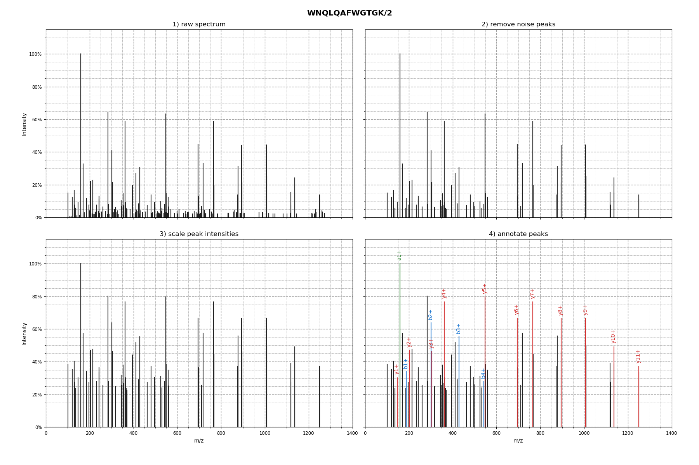

==================
``spectrum_utils``
==================

.. image:: https://travis-ci.org/bittremieux/spectrum_utils.svg?master
    :target: https://travis-ci.org/bittremieux/spectrum_utils
.. image:: https://img.shields.io/badge/python-3.6-brightgreen.svg
.. image:: https://img.shields.io/badge/python-3.7-brightgreen.svg

Efficient MS/MS spectrum processing and visualization in Python.

Features
--------

- Spectrum processing
    - Precursor & noise peak removal
    - Intensity filtering
    - Intensity scaling
    - Peak annotations
        - Modification-aware (static & variable) peptide fragments
        - SMILES-based molecules
        - Custom strings
- Spectrum plotting
    - Fully customizable individual spectrum plots
    - Mirror plot of matching spectra
    - Interactive spectrum plots

Installation
------------

``spectrum_utils`` can be installed easily using conda::

    conda install -c bioconda spectrum_utils

Dependencies
~~~~~~~~~~~~

``spectrum_utils`` has the following dependencies:

- `Altair <https://altair-viz.github.io/>`_
- `Matplotlib <https://matplotlib.org/>`_
- `Numba <http://numba.pydata.org/>`_
- `NumPy <https://www.numpy.org/>`_
- `Pandas <https://pandas.pydata.org/>`_
- `Pyteomics <https://pyteomics.readthedocs.io/>`_
- `RDKit <https://www.rdkit.org/>`_

Missing dependencies will be automatically installed when you install ``spectrum_utils``.

Alternative installation options
~~~~~~~~~~~~~~~~~~~~~~~~~~~~~~~~

The recommended way to install ``spectrum_utils`` is using conda. Alternatively ``spectrum_utils`` can also be installed using pip::

    pip install spectrum_utils

To install the basic ``spectrum_utils`` version. Or::

    pip install spectrum_utils[iplot]

To include the interactive plotting functionality (requires Pandas and Altair).

When installing using pip it is recommended to explicitly install any dependencies (listed above) in advance. Any missing dependencies will be automatically installed from PyPI when you install ``spectrum_utils``, *except* RDKit. Please refer to the `RDKit installation notes <https://www.rdkit.org/docs/Install.html>`_ for information on how to install RDKit.

In contrast, when installing ``spectrum_utils`` using conda all dependencies will be automatically installed, including RDKit.

Example
-------

::

    import spectrum_utils.plot as sup
    import spectrum_utils.spectrum as sus

    # Initialize spectrum information first...

    spectrum = sus.MsmsSpectrum(identifier, precursor_mz, precursor_charge,
                                mz, intensity, retention_time=retention_time,
                                peptide=peptide)

    # Preprocess the MS/MS spectrum.
    fragment_tol_mass = 10
    fragment_tol_mode = 'ppm'
    spectrum = (spectrum.set_mz_range(min_mz=100, max_mz=1400)
                .remove_precursor_peak(fragment_tol_mass, fragment_tol_mode)
                .filter_intensity(min_intensity=0.05, max_num_peaks=50)
                .annotate_peptide_fragments(fragment_tol_mass, fragment_tol_mode,
                                            ion_types='aby'))

    # Plot the MS/MS spectrum.
    sup.spectrum(spectrum, grid=False)

API documentation
-----------------

.. toctree::

    spectrum_utils

Contact
-------

For more information you can visit the `official code website <https://github.com/bittremieux/spectrum_utils/>`_ or send an `email <wout.bittremieux@uantwerpen.be>`_.
