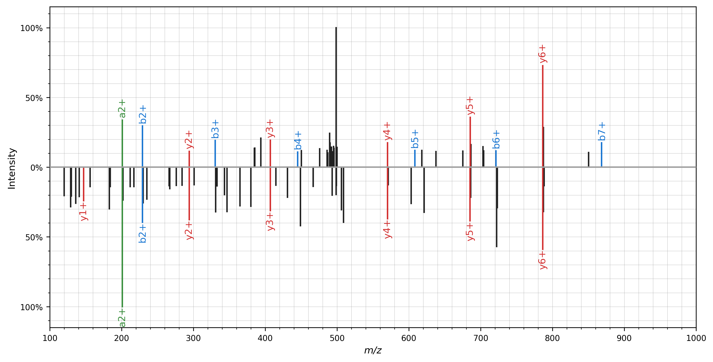

# Spectrum visualization

The [quickstart](quickstart.md) and [spectrum processing](processing.md) pages
include several examples that demonstrate the spectrum_utils plotting
functionality. Often, nice spectrum graphics can be created with a single line
of code; it's as easy as using `spectrum_utils.plot.spectrum(...)` to visualize
a single spectrum. Additionally, these examples show how peaks will be
annotated with peptide fragments, molecule structures, their _m_/_z_ values, or
custom strings.

Here we will briefly describe some functionality to customize your spectrum
plots. Some of the arguments that can be provided to
`spectrum_utils.plot.spectrum(...)` are:

- `color_ions` and `annotate_ions`: Boolean flags indicating whether the peaks
should be colored and/or annotated.
- `annot_kws`: A dictionary with options to customize textual peak annotations.
See the
[`matplotlib.text.Text` documentation](https://matplotlib.org/3.1.1/api/text_api.html#matplotlib.text.Text)
for available options.
- `grid`: Enable/disable the grid.

See the [API reference](api.md) for more information.

## Mirror plot

A mirror plot can be used to visualize matching spectra, for example, to
plot identifications from spectral library searching. Again, only a single line
of code is required to do the actual plotting:
`spectrum_utils.plot.mirror(...)`

```python
import matplotlib.pyplot as plt
import spectrum_utils.plot as sup
import spectrum_utils.spectrum as sus
from pyteomics import mgf


spectra = []
for spectrum_dict in mgf.read('spectra.mgf'):
    if 'DLTDYLMK' in spectrum_dict['params']['title']:
        identifier = spectrum_dict['params']['title']
        precursor_mz = spectrum_dict['params']['pepmass'][0]
        precursor_charge = spectrum_dict['params']['charge'][0]
        mz = spectrum_dict['m/z array']
        intensity = spectrum_dict['intensity array']
        retention_time = float(spectrum_dict['params']['rtinseconds'])
        peptide = 'DLTDYLMK'
        modifications = {6: 15.994915}

        # Create the MS/MS spectrum.
        spectra.append(sus.MsmsSpectrum(identifier, precursor_mz,
                                        precursor_charge, mz, intensity,
                                        retention_time=retention_time,
                                        peptide=peptide,
                                        modifications=modifications)
                       .filter_intensity(0.01, 50)
                       .scale_intensity('root')
                       .annotate_peptide_fragments(0.5, 'Da', ion_types='aby'))

fig, ax = plt.subplots(figsize=(12, 6))
spectrum_top, spectrum_bottom = spectra
sup.mirror(spectrum_top, spectrum_bottom, ax=ax)
plt.show()
plt.close()
```



All of the advanced plotting arguments described above can be provided for the
mirror plot as well using the `spectrum_kws` argument.

## Interactive plotting

Besides the standard plotting functionality in `spectrum_utils.plot`,
spectrum_utils also contains dynamic plotting functionality in
`spectrum_utils.iplot`. `iplot` is a drop-in replacement for `plot`; only the
import statement needs to be changed to generate interactive plots.

See below for example interactive plots of a single spectrum and a mirror plot.

<script src="https://cdn.jsdelivr.net/npm/vega@5"></script>
<script src="https://cdn.jsdelivr.net/npm/vega-lite@3"></script>
<script src="https://cdn.jsdelivr.net/npm/vega-embed@4"></script>

```python
import spectrum_utils.iplot as sup
import spectrum_utils.spectrum as sus
from pyteomics import mgf


# Read the spectrum from an MGF file using Pyteomics.
spectrum_dict = mgf.get_spectrum(
    'spectra.mgf',
    'mzspec:PXD004732:01650b_BC2-TUM_first_pool_53_01_01-3xHCD-1h-R2:scan:'
    '41840:WNQLQAFWGTGK/2')
identifier = spectrum_dict['params']['title']
precursor_mz = spectrum_dict['params']['pepmass'][0]
precursor_charge = spectrum_dict['params']['charge'][0]
mz = spectrum_dict['m/z array']
intensity = spectrum_dict['intensity array']
retention_time = float(spectrum_dict['params']['rtinseconds'])
peptide = 'WNQLQAFWGTGK'

# Create the MS/MS spectrum.
spectrum = sus.MsmsSpectrum(
    identifier, precursor_mz, precursor_charge, mz, intensity,
    retention_time=retention_time, peptide=peptide)

# Process the MS/MS spectrum.
fragment_tol_mass = 10
fragment_tol_mode = 'ppm'
spectrum = (spectrum.set_mz_range(min_mz=100, max_mz=1400)
            .remove_precursor_peak(fragment_tol_mass, fragment_tol_mode)
            .filter_intensity(min_intensity=0.05, max_num_peaks=50)
            .scale_intensity('root')
            .annotate_peptide_fragments(fragment_tol_mass, fragment_tol_mode,
                                        ion_types='aby'))

# Plot the MS/MS spectrum.
(sup.spectrum(spectrum).properties(width=640, height=400)
                       .save('spectrum_iplot.json'))
```

<div id="spectrum"></div>

```python
import spectrum_utils.iplot as sup
import spectrum_utils.spectrum as sus
from pyteomics import mgf


spectra = []
for spectrum_dict in mgf.read('../docs/spectra.mgf'):
    if 'DLTDYLMK' in spectrum_dict['params']['title']:
        identifier = spectrum_dict['params']['title']
        precursor_mz = spectrum_dict['params']['pepmass'][0]
        precursor_charge = spectrum_dict['params']['charge'][0]
        mz = spectrum_dict['m/z array']
        intensity = spectrum_dict['intensity array']
        retention_time = float(spectrum_dict['params']['rtinseconds'])
        peptide = 'DLTDYLMK'
        modifications = {6: 15.994915}

        # Create the MS/MS spectrum.
        spectra.append(sus.MsmsSpectrum(identifier, precursor_mz,
                                        precursor_charge, mz, intensity,
                                        retention_time=retention_time,
                                        peptide=peptide,
                                        modifications=modifications)
                       .filter_intensity(0.01, 50)
                       .scale_intensity('root')
                       .annotate_peptide_fragments(0.5, 'Da', ion_types='aby'))

spectrum_top, spectrum_bottom = spectra
(sup.mirror(spectrum_top, spectrum_bottom).properties(width=800, height=600)
                                          .save('mirror_iplot.json'))
```

<div id="mirror"></div>

<script type="text/javascript">
  var mirror = "https://raw.githubusercontent.com/bittremieux/spectrum_utils/master/docs/mirror_iplot.json";
  var spectrum = "https://raw.githubusercontent.com/bittremieux/spectrum_utils/master/docs/spectrum_iplot.json";
  vegaEmbed('#mirror', mirror).then(function(result) {
  }).catch(console.error);
  vegaEmbed('#spectrum', spectrum).then(function(result) {
  }).catch(console.error);
</script>

For more information on how to manipulate these interactive plots, see the
[Altair documentation](https://altair-viz.github.io/index.html).

Interactive plots can be
[saved](https://altair-viz.github.io/user_guide/saving_charts.html) as html
files or other output formats. [Vega-Embed](https://github.com/vega/vega-embed)
makes it easy to embed plots exported as JSON into web pages.

## Advanced functionality

### Peak colors

By default, peaks are colored as follows:

- <svg width="10" height="10"><rect width="10" height="10" style="fill:#388E3C;stroke-width:1;stroke:rgb(0,0,0)" /></svg> a-ions
- <svg width="10" height="10"><rect width="10" height="10" style="fill:#1976D2;stroke-width:1;stroke:rgb(0,0,0)" /></svg> b-ions
- <svg width="10" height="10"><rect width="10" height="10" style="fill:#00796B;stroke-width:1;stroke:rgb(0,0,0)" /></svg> c-ions
- <svg width="10" height="10"><rect width="10" height="10" style="fill:#7B1FA2;stroke-width:1;stroke:rgb(0,0,0)" /></svg> x-ions
- <svg width="10" height="10"><rect width="10" height="10" style="fill:#D32F2F;stroke-width:1;stroke:rgb(0,0,0)" /></svg> y-ions
- <svg width="10" height="10"><rect width="10" height="10" style="fill:#F57C00;stroke-width:1;stroke:rgb(0,0,0)" /></svg> z-ions
- <svg width="10" height="10"><rect width="10" height="10" style="fill:#212121;stroke-width:1;stroke:rgb(0,0,0)" /></svg> unknown and unannotated ions

To change these colors, simply overwrite values in the
`spectrum_utils.plot.colors` dictionary with your preferred colors:

```python
import spectrum_utils.plot as sup


sup.colors['y'] = '#FF1493'
```
