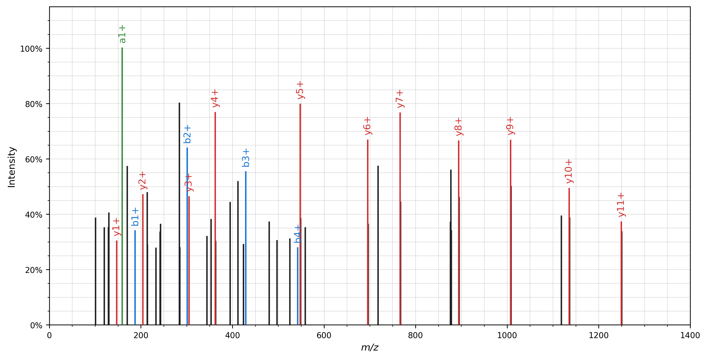

# Quickstart

Here we briefly introduce spectrum_utils' MS/MS spectrum processing and
visualization functionality:

- Restrict the mass range to 100–1400 _m_/_z_ to filter out irrelevant peaks.
- Remove the precursor peak.
- Remove low-intensity noise peaks by only retaining peaks that are at at least
5% of the base peak intensity and restrict the total number of peaks to the 50
most intense peaks.
- Scale the peak intensities by their square root to de-emphasize overly
intense peaks.
- Annotate peaks corresponding to 'b', 'y', and 'a' peptide fragments.

IO functionality is not included in spectrum_utils. Instead you can use
excellent libraries to read a variety of mass spectrometry data formats such as
[Pyteomics](https://pyteomics.readthedocs.io/) or
[pymzML](https://pymzml.readthedocs.io/).

```python
import matplotlib.pyplot as plt
import spectrum_utils.plot as sup
import spectrum_utils.spectrum as sus
from pyteomics import mgf


# Read the spectrum from an MGF file using Pyteomics.
spectrum_dict = mgf.get_spectrum(
    'spectra.mgf',
    'mzspec:PXD004732:01650b_BC2-TUM_first_pool_53_01_01-3xHCD-1h-R2:scan:'
    '41840:WNQLQAFWGTGK/2')
identifier = spectrum_dict['params']['title']
precursor_mz = spectrum_dict['params']['pepmass'][0]
precursor_charge = spectrum_dict['params']['charge'][0]
mz = spectrum_dict['m/z array']
intensity = spectrum_dict['intensity array']
retention_time = float(spectrum_dict['params']['rtinseconds'])
peptide = 'WNQLQAFWGTGK'

# Create the MS/MS spectrum.
spectrum = sus.MsmsSpectrum(
    identifier, precursor_mz, precursor_charge, mz, intensity,
    retention_time=retention_time, peptide=peptide)

# Process the MS/MS spectrum.
fragment_tol_mass = 10
fragment_tol_mode = 'ppm'
spectrum = (spectrum.set_mz_range(min_mz=100, max_mz=1400)
            .remove_precursor_peak(fragment_tol_mass, fragment_tol_mode)
            .filter_intensity(min_intensity=0.05, max_num_peaks=50)
            .scale_intensity('root')
            .annotate_peptide_fragments(fragment_tol_mass, fragment_tol_mode,
                                        ion_types='aby'))

# Plot the MS/MS spectrum.
fig, ax = plt.subplots(figsize=(12, 6))
sup.spectrum(spectrum, ax=ax)
plt.show()
plt.close()
```

As demonstrated, each of the processing steps can be achieved using a single,
high-level function call. These calls can be chained together to easily
perform multiple processing steps.

Note that several processing steps modify the peak _m_/_z_ and intensity values
and are thus not idempotent.

Spectrum plotting can similarly be achieved using a high-level function call,
resulting in the following figure:


