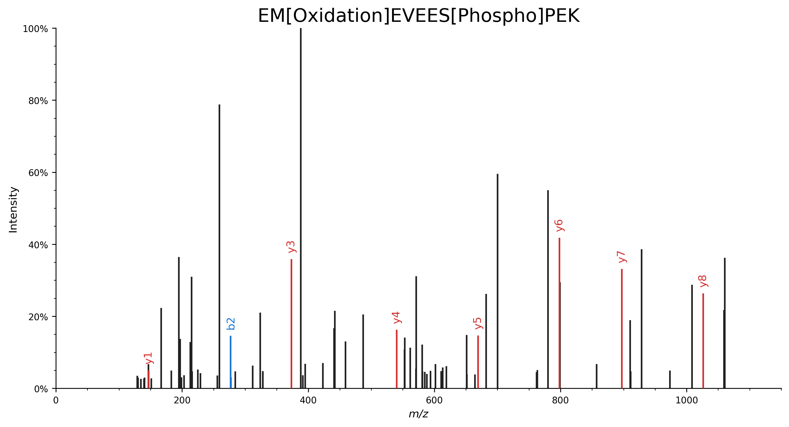
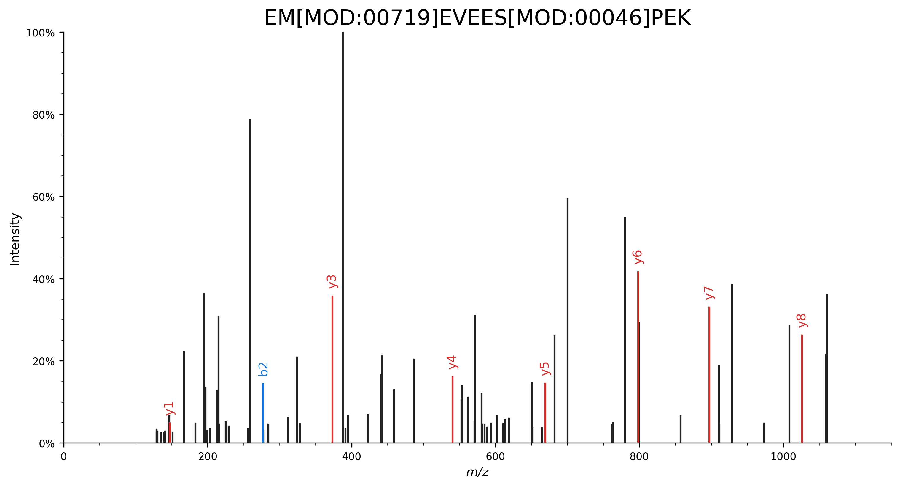
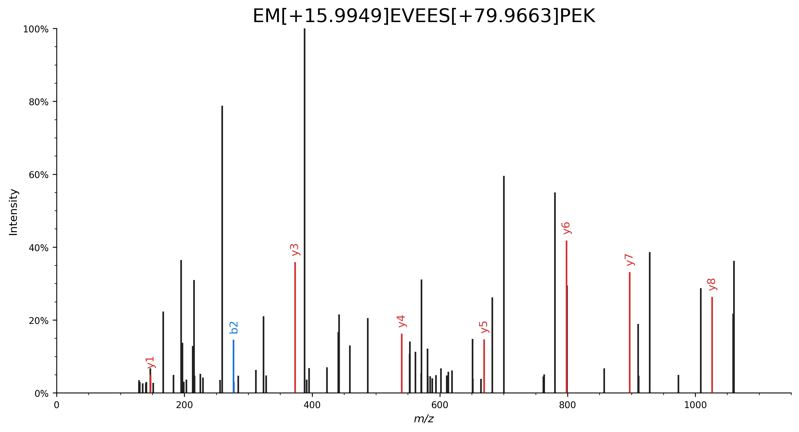
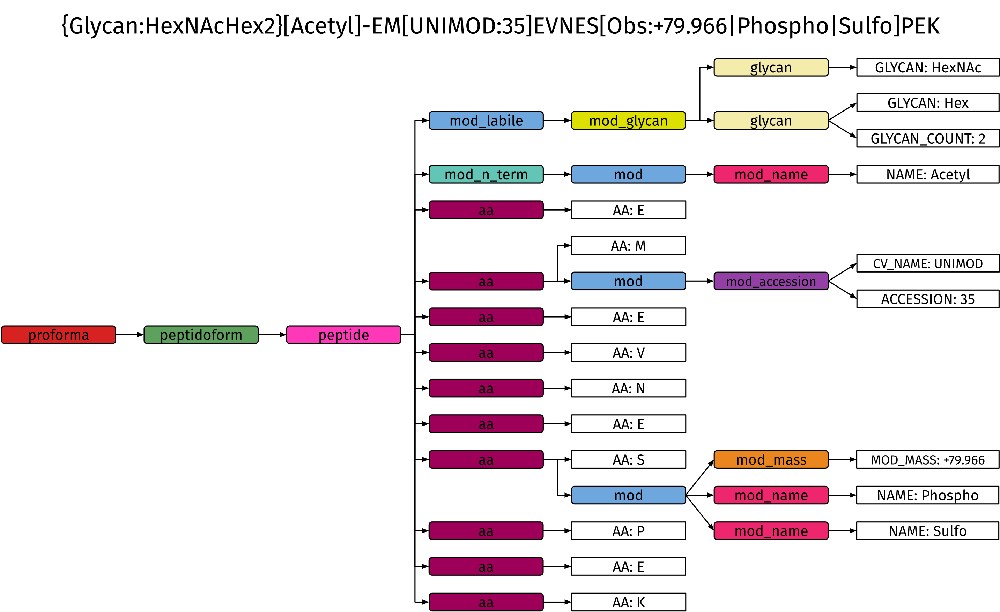
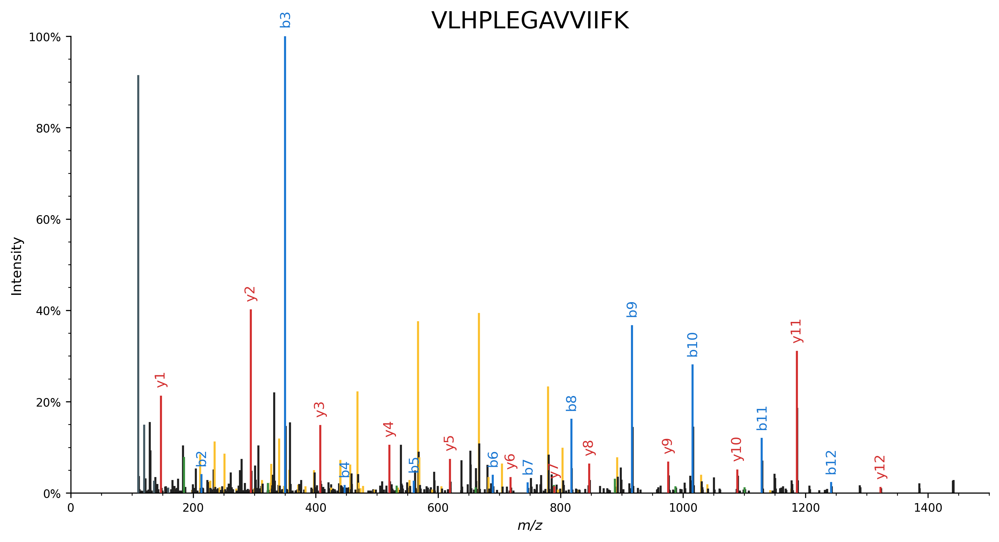
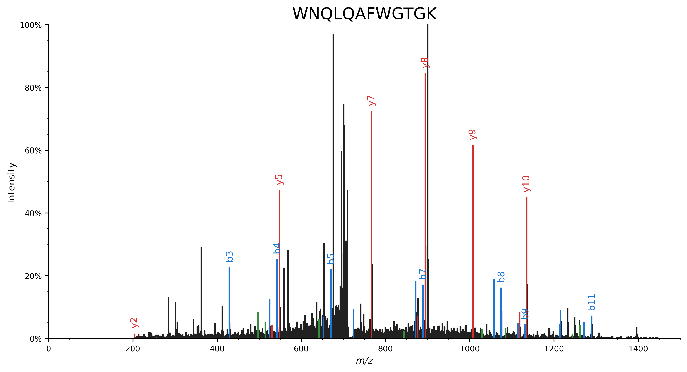
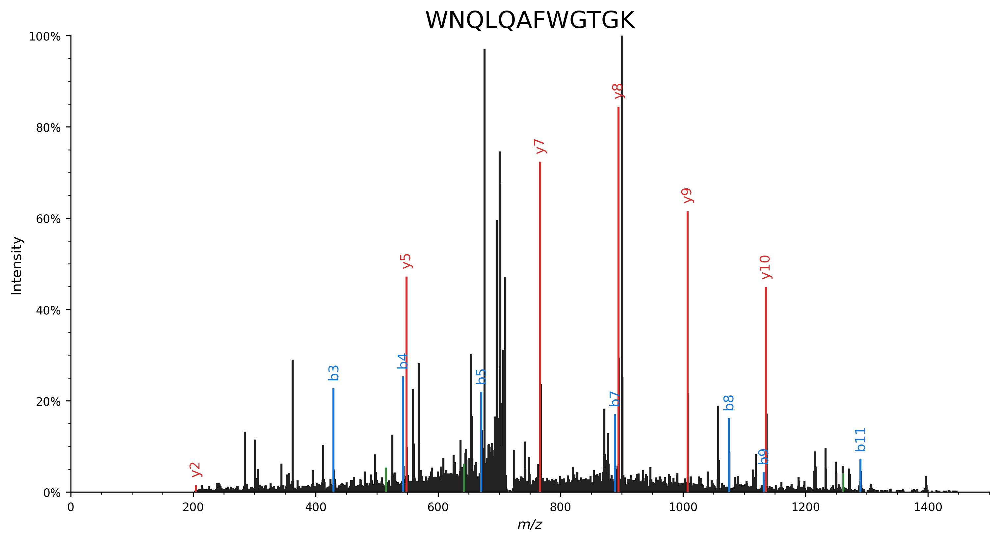

# Spectrum annotating

See the [quickstart](quickstart.md) for a brief introduction on how to start using spectrum_utils.
Here we will describe the spectrum annotation functionality provided by spectrum_utils in more detail.

## Fragment ion annotation

As demonstrated in the [quickstart](quickstart.md), fragment ions can be annotated based on the [ProForma 2.0](https://www.psidev.info/proforma) specification.

The ProForma specification makes it possible to unambiguously represent peptide sequences and peptidoforms, which are specific forms of peptides that results from the combination of the amino acid sequences and modification(s) at specific amino acid positions.
Modifications are defined by controlled vocabularies (CVs), including [Unimod](https://www.unimod.org/), [PSI-MOD](https://github.com/HUPO-PSI/psi-mod-CV/), and others, and can be specified by their name or CV accession.
ProForma also supports special modification use cases, including support for modifications from cross-linking (using [XL-MOD](https://arxiv.org/abs/2003.00329)), glycans (using the [Glycan Naming Ontology](https://gnome.glyomics.org/)), and top-down extensions.

The following are (non-exhaustive) examples to demonstrate how ProForma can be used to annotate peaks in spectra:

- Specify modifications by their name: `EM[Oxidation]EVEES[Phospho]PEK`.
    ```python
    import matplotlib.pyplot as plt
    import spectrum_utils.plot as sup
    import spectrum_utils.spectrum as sus


    # Retrieve the spectrum by its USI.
    usi = "mzspec:MSV000082283:f07074:scan:5475"
    spectrum = sus.MsmsSpectrum.from_usi(usi)

    # Annotate the spectrum with its ProForma string.
    peptide = "EM[Oxidation]EVEES[Phospho]PEK"
    spectrum = spectrum.annotate_proforma(peptide, 10, "ppm")

    # Plot the spectrum.
    fig, ax = plt.subplots(figsize=(12, 6))
    sup.spectrum(spectrum, grid=False, ax=ax)
    ax.set_title(peptide, fontdict={"fontsize": "xx-large"})
    ax.spines["right"].set_visible(False)
    ax.spines["top"].set_visible(False)
    plt.savefig("proforma_ex1.png", bbox_inches="tight", dpi=300, transparent=True)
    plt.close()
    ```
    

- Specify modifications by their CV accession: `EM[MOD:00719]EVEES[MOD:00046]PEK`.
    ```python
    import matplotlib.pyplot as plt
    import spectrum_utils.plot as sup
    import spectrum_utils.spectrum as sus


    # Retrieve the spectrum by its USI.
    usi = "mzspec:MSV000082283:f07074:scan:5475"
    spectrum = sus.MsmsSpectrum.from_usi(usi)

    # Annotate the spectrum with its ProForma string.
    peptide = "EM[MOD:00719]EVEES[MOD:00046]PEK"
    spectrum = spectrum.annotate_proforma(peptide, 10, "ppm")

    # Plot the spectrum.
    fig, ax = plt.subplots(figsize=(12, 6))
    sup.spectrum(spectrum, grid=False, ax=ax)
    ax.set_title(peptide, fontdict={"fontsize": "xx-large"})
    ax.spines["right"].set_visible(False)
    ax.spines["top"].set_visible(False)
    plt.savefig("proforma_ex2.png", bbox_inches="tight", dpi=300, transparent=True)
    plt.close()
    ```
    

- Specify modifications by their delta mass: `EM[+15.9949]EVEES[+79.9663]PEK`.
    ```python
    import matplotlib.pyplot as plt
    import spectrum_utils.plot as sup
    import spectrum_utils.spectrum as sus


    # Retrieve the spectrum by its USI.
    usi = "mzspec:MSV000082283:f07074:scan:5475"
    spectrum = sus.MsmsSpectrum.from_usi(usi)

    # Annotate the spectrum with its ProForma string.
    peptide = "EM[+15.9949]EVEES[+79.9663]PEK"
    spectrum = spectrum.annotate_proforma(peptide, 10, "ppm")

    # Plot the spectrum.
    fig, ax = plt.subplots(figsize=(12, 6))
    sup.spectrum(spectrum, grid=False, ax=ax)
    ax.set_title(peptide, fontdict={"fontsize": "xx-large"})
    ax.spines["right"].set_visible(False)
    ax.spines["top"].set_visible(False)
    plt.savefig("proforma_ex3.png", bbox_inches="tight", dpi=300, transparent=True)
    plt.close()
    ```
    

For full details and advanced use cases, please consult the [ProForma 2.0](https://www.psidev.info/proforma) specification.

### Supported ProForma 2.0 features

As described in the [ProForma 2.0 specification](https://www.psidev.info/proforma), there are several levels of compliance.
spectrum_utils uniquely supports the _full_ ProForma 2.0 specification, including the following features:

1. Base Level Support.
Represents the lowest level of compliance, this level involves providing support for:
    - Amino acid sequences.
    - Protein modifications using two of the supported CVs/ontologies: Unimod and PSI-MOD.
    - Protein modifications using delta masses (without prefixes).
    - N-terminal, C-terminal, and labile modifications.
    - Ambiguity in the modification position, including support for localization scores.
    - `INFO` tag.

2. Additional Separate Support.
These features are independent from each other:
    - Unusual amino acids (O and U).
    - Ambiguous amino acids (e.g. X, B, Z).
    This would include support for sequence tags of known mass (using the character X).
    - Protein modifications using delta masses (using prefixes for the different CVs/ontologies).
    - Use of prefixes for Unimod (`U:`) and PSI-MOD (`M:`) names.
    - Support for the joint representation of experimental data and its interpretation.

3. Top Down Extensions.
    - Additional CV/ontologies for protein modifications: RESID (the prefix `R` MUST be used for RESID CV/ontology term names).
    - Chemical formulas (this feature occurs in two places in this list).

4. Cross-Linking Extensions
    - Cross-linked peptides (using the XL-MOD CV/ontology, the prefix `X` MUST be used for XL-MOD CV/ontology term names).

5. Glycan Extensions.
    - Additional CV/ontologies for protein modifications: GNO (the prefix `G` MUST be used for GNO CV/ontology term names).
    - Glycan composition.
    - Chemical formulas (this feature occurs in two places in this list).

6. Spectral Support.
    - Charge and chimeric spectra are special cases (see Appendix II).
    - Global modifications (e.g., every C is C13).

### Implementation details

Internally, spectrum_utils represents the ProForma 2.0 specification as a formal grammar which is used to create an abstract syntax tree when parsing a ProForma string.
This approach is similar to how compilers interpret complex source code instructions, and the formal grammar is the only existing codified representation for ProForma 2.0 that is machine-readable.
This is an extremely robust and scalable solution to cover the full ProForma 2.0 specification, including optional extensions and edge cases, compared to alternative approaches, such as combinations of regular expressions.

Example abstract syntax tree for `{Glycan:HexNAcHex2}[Acetyl]-EM[UNIMOD:35]EVNES[Obs:+79.966|Phospho|Sulfo]PEK`, which demonstrates several functionalities of the ProForma specification:

- Multiple labile glycan modifications (1 HexNAc and 2 Hex).
- An N-terminal acetylation specified by its [modification name (in Unimod)](https://www.unimod.org/modifications_view.php?editid1=1).
- Oxidation of methionine specified by its [Unimod accession (`UNIMOD:35`)](https://www.unimod.org/modifications_view.php?editid1=35).
- An observed mass difference of 79.966 Da that can interpreted as a [phosphorylation](https://www.unimod.org/modifications_view.php?editid1=21) or [sulfation](https://www.unimod.org/modifications_view.php?editid1=40).



(ion_types)=
## Ion types

During fragment ion annotation, by default peptide b and y ions will be annotated.
Additionally, spectrum_utils supports several other ion types:

- Primary `"a"`, `"b"`, `"c"`, `"x"`, `"y"`, and `"z"` peptide fragments.
- Internal fragment ions `"m"`, which result from two amide bond cleavages and thus do not contain either terminus.
- Immonium ions `"I"`, which are internal fragments for individual amino acids formed by a b/y cleavage on the N-terminal side and an a/x cleavage on the C-terminal side.
- Intact precursor ions `"p"`.
- Reporter ions from isobaric labeling `"r"`.

Specify the desired ion types when annotating a spectrum using its ProForma string.
For example, `MsmsSpectrum.annotate_proforma(..., ion_types="abyIm")` will find matching peaks for the a, b, and y peptide fragments, immonium ions, and internal fragment ions.

```python
import matplotlib.pyplot as plt
import spectrum_utils.plot as sup
import spectrum_utils.spectrum as sus


usi = "mzspec:PXD000561:Adult_Frontalcortex_bRP_Elite_85_f09:scan:17555"
peptide = "VLHPLEGAVVIIFK"
spectrum = sus.MsmsSpectrum.from_usi(usi)
spectrum.annotate_proforma(peptide, 10, "ppm", ion_types="abyIm")

fig, ax = plt.subplots(figsize=(12, 6))
sup.spectrum(spectrum, grid=False, ax=ax)
ax.set_title(peptide, fontdict={"fontsize": "xx-large"})
ax.spines["right"].set_visible(False)
ax.spines["top"].set_visible(False)
plt.savefig("ion_types.png", dpi=300, bbox_inches="tight", transparent=True)
plt.close()
```


Besides the canonical peptide fragments, we can also observe immomium ions (dark gray) and several internal fragment ions (yellow).

## Neutral losses

Each of the above ions can also be automatically considered with a neutral loss (or gain).
Neutral losses need to be specified by a concise label (preferably their molecular formula) and mass difference:

The following example demonstrates how the number of observed peaks that can be interpreted increases by considering fragments with an optional ammonia (NH3) or water (H2O) neutral loss:

```python
import matplotlib.pyplot as plt
import spectrum_utils.plot as sup
import spectrum_utils.spectrum as sus


usi = "mzspec:PXD014834:TCGA-AA-3518-01A-11_W_VU_20120915_A0218_3F_R_FR01:scan:8370"
peptide = "WNQLQAFWGTGK"
spectrum = sus.MsmsSpectrum.from_usi(usi)
spectrum.annotate_proforma(
    peptide,
    fragment_tol_mass=0.05,
    fragment_tol_mode="Da",
    ion_types="aby",
    neutral_losses={"NH3": -17.026549, "H2O": -18.010565},
)

fig, ax = plt.subplots(figsize=(12, 6))
sup.spectrum(spectrum, grid=False, ax=ax)
ax.set_title(peptide, fontdict={"fontsize": "xx-large"})
ax.spines["right"].set_visible(False)
ax.spines["top"].set_visible(False)
plt.savefig("neutral_losses_1.png", dpi=300, bbox_inches="tight", transparent=True)
plt.close()
```



Peaks that correspond to peptide fragments with a neutral loss are highlighted in the matching color.

In contrast, the same peptide--spectrum match without considering neutral losses is able to explain far fewer peaks:

```python
import matplotlib.pyplot as plt
import spectrum_utils.plot as sup
import spectrum_utils.spectrum as sus


usi = "mzspec:PXD014834:TCGA-AA-3518-01A-11_W_VU_20120915_A0218_3F_R_FR01:scan:8370"
peptide = "WNQLQAFWGTGK"
spectrum = sus.MsmsSpectrum.from_usi(usi)
spectrum.annotate_proforma(
    peptide, fragment_tol_mass=0.05, fragment_tol_mode="Da", ion_types="aby",
)

fig, ax = plt.subplots(figsize=(12, 6))
sup.spectrum(spectrum, grid=False, ax=ax)
ax.set_title(peptide, fontdict={"fontsize": "xx-large"})
ax.spines["right"].set_visible(False)
ax.spines["top"].set_visible(False)
plt.savefig("neutral_losses_2.png", dpi=300, bbox_inches="tight", transparent=True)
plt.close()
```



### Common neutral losses

Overview of common neutral losses:

| Neutral loss/gain | Molecular formula | Mass difference |
| --- | --- | --- |
| Hydrogen | H | 1.007825 |
| Ammonia | NH3 | 17.026549 |
| Water | H2O | 18.010565 |
| Carbon monoxide | CO | 27.994915 |
| Carbon dioxide | CO2 | 43.989829 |
| Formamide | HCONH2 | 45.021464 |
| Formic acid | HCOOH | 46.005479 |
| Methanesulfenic acid | CH4OS | 63.998301 |
| Sulfur trioxide | SO3 | 79.956818 |
| Metaphosphoric acid | HPO3 | 79.966331 |
| Mercaptoacetamide | C2H5NOS | 91.009195 |
| Mercaptoacetic acid | C2H4O2S | 91.993211 |
| Phosphoric acid | H3PO4 | 97.976896 |

Note that typically the neutral _loss_ mass difference should be negative.

By default, no neutral losses are considered.
If the `neutral_losses` argument of `MsmsSpectrum.annotate_proforma(...)` is set to `True`, all above mass differences will be considered as neutral losses (negative).
