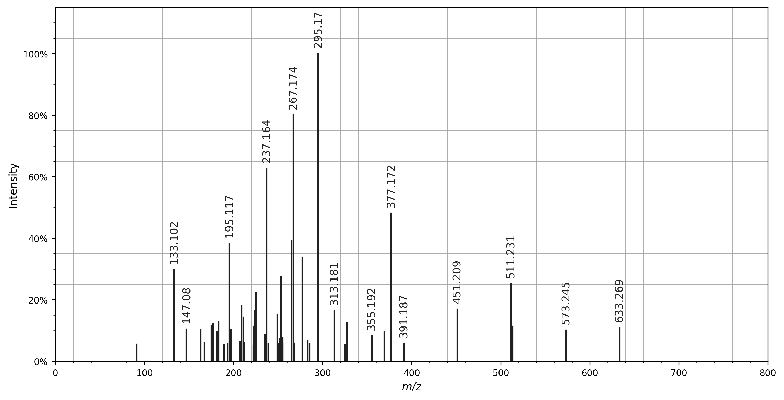

# Spectrum processing

See the [quickstart](quickstart.md) for a brief introduction to how to start
using spectrum_utils. Here we will describe the spectrum processing
functionality provided by spectrum_utils in more detail.

## Peak annotations

Fragment ions can be annotated as follows:

- Using `MsmsSpectrum.annotate_peptide_fragments(...)` to annotate a, b, c, x,
y, or z ions for peptide spectra.
- Using `MsmsSpectrum.annotate_molecule_fragment(...)` using SMILES strings to
annotate peaks with molecule (sub)structures.
- Using `MsmsSpectrum.annotate_mz_fragment(...)` to annotate peaks with their
_m_/_z_ value or user-provided custom strings.

Peak annotations can be visualized using the spectrum_utils plotting
functionality.

The example in the [quickstart](quickstart.md) shows how spectrum peaks can be
annotated with peptide fragments.

The following example shows how spectrum peaks can be annotated with their
_m_/_z_ values:

```python
import matplotlib.pyplot as plt
import spectrum_utils.spectrum as sus
import spectrum_utils.plot as sup
from pyteomics import mgf


spectrum_dict = mgf.get_spectrum('spectra.mgf', 'CCMSLIB00000840351')
identifier = spectrum_dict['params']['title']
precursor_mz = spectrum_dict['params']['pepmass'][0]
precursor_charge = spectrum_dict['params']['charge'][0]
mz = spectrum_dict['m/z array']
intensity = spectrum_dict['intensity array']

spectrum = sus.MsmsSpectrum(
    identifier, precursor_mz, precursor_charge, mz, intensity)
spectrum.filter_intensity(0.05)

charge, tol_mass, tol_mode = 1, 0.5, 'Da'
annotate_fragment_mz = [133.102, 147.080, 195.117, 237.164, 267.174, 295.170,
                        313.181, 355.192, 377.172, 391.187, 451.209, 511.231,
                        573.245, 633.269]
for fragment_mz in annotate_fragment_mz:
    spectrum.annotate_mz_fragment(fragment_mz, charge, tol_mass, tol_mode)

fig, ax = plt.subplots(figsize=(12, 6))
sup.spectrum(spectrum, ax=ax)
plt.show()
plt.close()
```

Resulting in the following spectrum plot:



## Peptide modifications

When annotating peptide spectra the masses of the fragment ions will be
automatically calculated to annotate the corresponding peaks. This
functionality is modification-aware: you can specify static modifications to
globally change the mass of specific amino acid residues and variable
modifications to modify amino acids in specific positions for a given peptide.

### Static modifications

Static modifications can be set as follows:

```python
sus.static_modification('C', 57.02146)
```

To, for example, set a static carbamidomethylation of cysteine.

Modification mass differences can be either positive or negative.

All static modifications can be reset:

```python
sus.reset_modifications()
```

### Variable modifications

Variable modifications can be set for an individual spectrum and peptide by
specifying the amino acid index and corresponding mass difference for each
modification.

Modification positions can be the following:

- The index of the amino acid where the modification is present (0-based).
- 'N-term' for N-terminal modifications.
- 'C-term' for C-terminal modifications.

For example, for a spectrum corresponding to peptide 'DLTDYLMK' with an
oxidated methionine:

```python
peptide = 'DLTDYLMK'
modifications = {6: 15.994915}

spectrum = sus.spectrum.MsmsSpectrum(
    identifier, precursor_mz, precursor_charge, mz, intensity,
    peptide=peptide, modifications=modifications)
```
