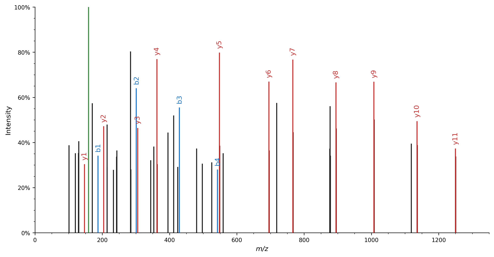

# Quickstart

Here we briefly introduce spectrum_utils' spectrum processing and visualization functionality:

- Load a spectrum from an online data resource by its [Universal Spectrum Identifier (USI)](https://www.psidev.info/usi).
- Restrict the mass range to 100–1400 _m_/_z_ to filter out irrelevant peaks.
- Remove the precursor peak.
- Remove low-intensity noise peaks by only retaining peaks that are at at least 5% of the base peak intensity and restrict the total number of peaks to the 50 most intense peaks.
- Scale the peak intensities by their square root to de-emphasize overly intense peaks.
- Annotate peaks corresponding to a, b, and y peptide fragments in the spectrum based on a [ProForma 2.0](https://www.psidev.info/proforma) peptide string.
- Visualize the spectrum with the annotated peaks highlighted.

IO functionality to read spectra from MS data files is not directly included in spectrum_utils.
Instead you can use excellent libraries to read a variety of mass spectrometry data formats such as [Pyteomics](https://pyteomics.readthedocs.io/) or [pymzML](https://pymzml.readthedocs.io/).

```python
import matplotlib.pyplot as plt
import spectrum_utils.plot as sup
import spectrum_utils.spectrum as sus


# Retrieve the spectrum by its USI.
usi = "mzspec:PXD004732:01650b_BC2-TUM_first_pool_53_01_01-3xHCD-1h-R2:scan:41840"
peptide = "WNQLQAFWGTGK"
spectrum = sus.MsmsSpectrum.from_usi(usi)

# Process the spectrum.
fragment_tol_mass, fragment_tol_mode = 10, "ppm"
spectrum = (
    spectrum.set_mz_range(min_mz=100, max_mz=1400)
    .remove_precursor_peak(fragment_tol_mass, fragment_tol_mode)
    .filter_intensity(min_intensity=0.05, max_num_peaks=50)
    .scale_intensity("root")
    .annotate_proforma(
        peptide, fragment_tol_mass, fragment_tol_mode, ion_types="aby"
    )
)

# Plot the spectrum.
fig, ax = plt.subplots(figsize=(12, 6))
sup.spectrum(spectrum, grid=False, ax=ax)
ax.spines["right"].set_visible(False)
ax.spines["top"].set_visible(False)
plt.savefig("quickstart.png", bbox_inches="tight", dpi=300, transparent=True)
plt.close()
```

As demonstrated, each of the processing steps can be achieved using a single, high-level function call.
These calls can be chained together to easily perform multiple processing steps.

Spectrum plotting can similarly be achieved using a high-level function call, resulting in the following figure:



Note that several processing steps modify the peak _m_/_z_ and intensity values and are thus not idempotent.
It is recommended to make a copy of the `MsmsSpectrum` object prior to any processing if the raw peak values need to remain available as well.
